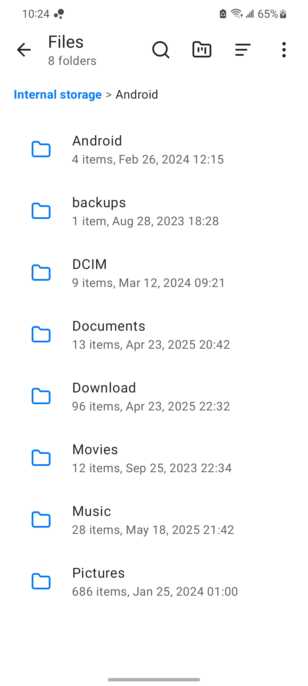
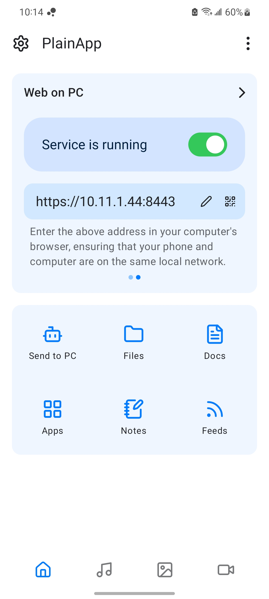
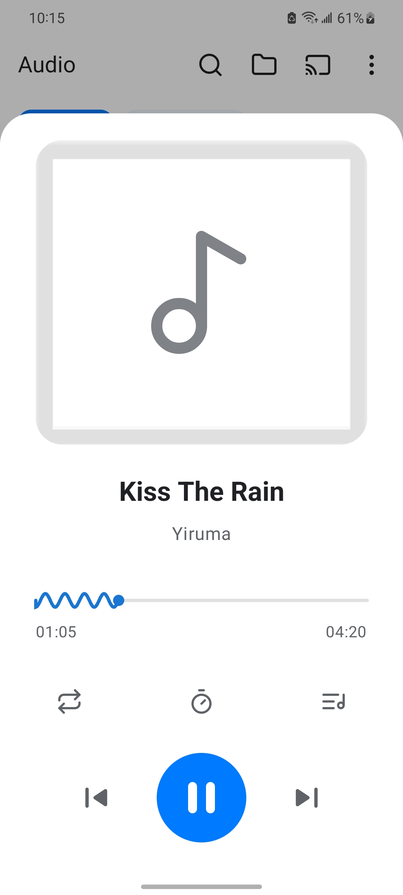
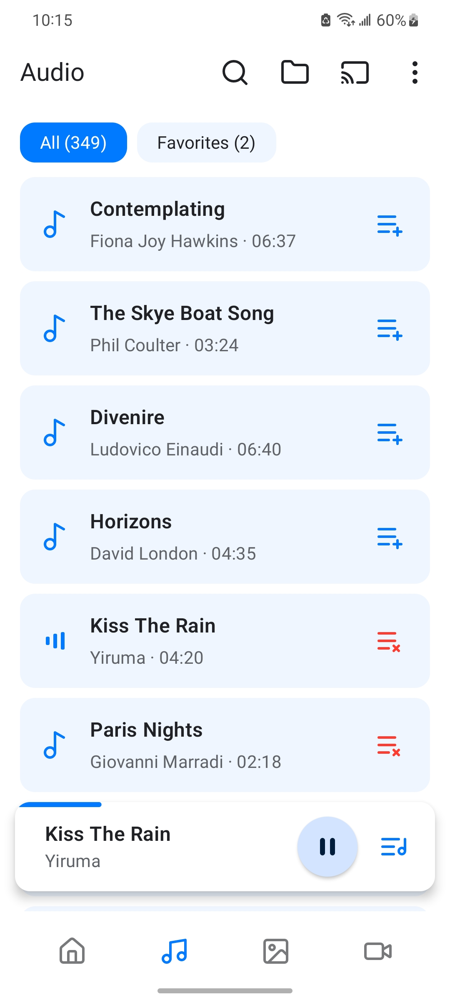
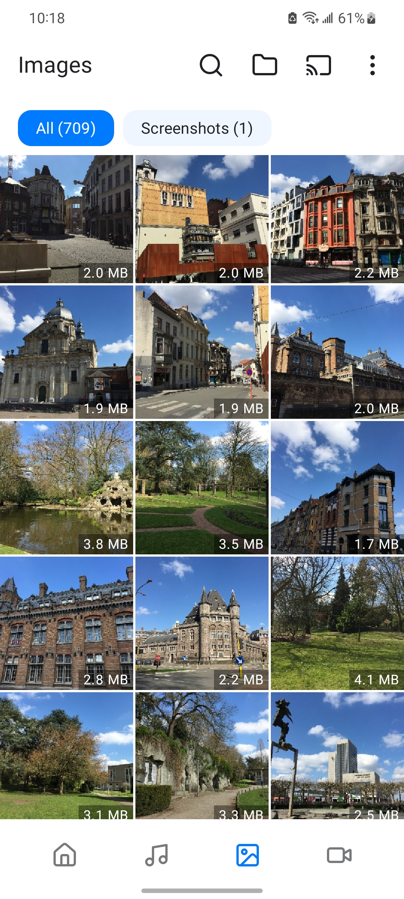
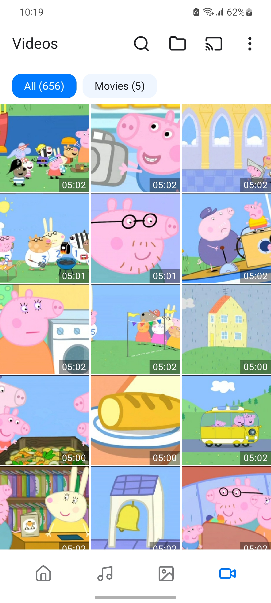

# PlainApp

PlainApp is an open-source app that lets you securely manage your phone from a web browser. Access files, media, contacts, SMS, calls, and more through a simple, easy-to-use interface on your desktop.

[](https://play.google.com/store/apps/details?id=com.ismartcoding.plain)
[](https://f-droid.org/packages/com.ismartcoding.plain/)
[](https://github.com/ismartcoding/plain-app/releases/latest)

## Features

**Privacy First**
- All data stays on your device — no cloud, no third-party storage
- No Firebase Messaging or Analytics; only crash logs (optional) via Firebase Crashlytics
- Secured with TLS + ChaCha20-Poly1305 encryption

**Ad-Free, Always**
- 100% ad-free experience, forever

**Clean, Modern Interface**
- Minimalist and customizable UI
- Supports multiple languages, light/dark themes

**Web-Based Desktop Management**  
Access a self-hosted webpage on the same network to manage your phone:
- Files: Internal storage, SD card, USB, images, videos, audio
- Contacts, SMS, and call logs
- Installed apps (with APK export)
- Notifications and device info
- Screen mirroring
- PWA support — add the web app to your desktop/home screen

**Built-in Tools**
- Markdown note-taking
- RSS reader with clean UI
- Video and audio player (in-app and on the web)
- TV casting for media
- Pomodoro timer
- Peer-to-peer chat and file sharing

**Always Improving**
- More features are on the way

PlainApp is designed with simplicity in mind, so you can focus on what matters most: your data.

Video: https://www.youtube.com/watch?v=TjRhC8pSQ6Q

Reddit: https://www.reddit.com/r/plainapp

Discord: https://discord.gg/RQWcS6DEEe

QQ Group: 812409393

## Donations :heart:

**This project needs you!** If you would like to support this project's further development, the creator of this project or the continuous maintenance of this project, **feel free to donate**.

Your donation is highly appreciated. Thank you!

- [Buy me a cup of Ko-Fi!](https://ko-fi.com/ismartcoding)

- Use WeChat to scan the code


## Screenshots

|   |         |  |                                                  |
|--------------------------------------|------------------------------------------|---------------------------------------------------|--------------------------------------------------|
|   |     |              |                   |
|     |     |              |               |
|   |  |          |         |
|  |           |      |  |
|   |         |                                                   |                                                  |

## Compatibility

PlainApp requires Android 9.0 or higher.

## FAQ

[http://docs.plain.icu/faq.html](http://docs.plain.icu/faq.html)

## Support

PlainApp is fully open-source.  
If you have any doubts, you're free to review the code, build your own version, or simply choose not to use it.

If you run into issues, feel free to open a GitHub issue — I'm always happy to help.

Please don’t leave a one-star review without giving it a fair try.

## Build

1. Generate `release.jks` file under `$rootProject/app` folder.

```bash
keytool -genkey -v -keystore ./app/release.jks -keyalg RSA -keysize 2048 -validity 10000 -alias plain
```

2. Create `keystore.properties` file with following content under `$rootProject` folder.

```
storePassword=
keyPassword=
keyAlias=plain
storeFile=release.jks
```

## Star history

[](https://star-history.com/#ismartcoding/plain-app&Date)


